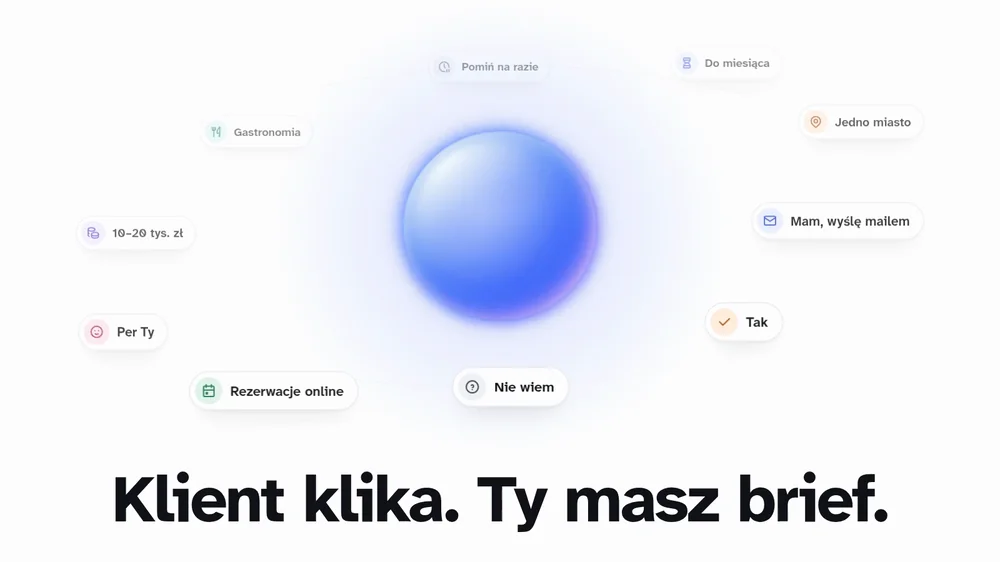
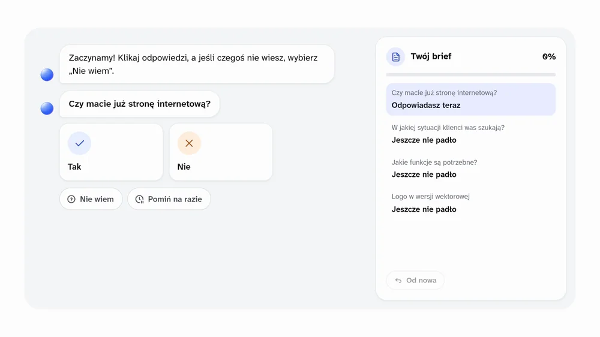
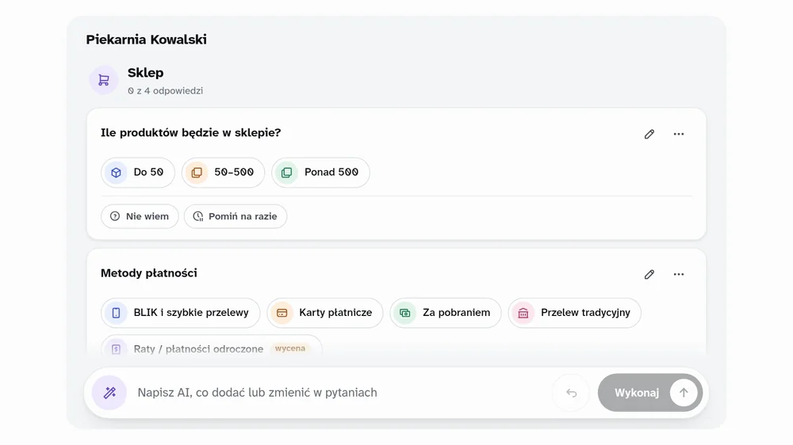

# BriefFlow

**Klient klika. Ty masz brief.**

Wysyłasz jeden link. Klient odpowiada na jedno pytanie naraz, głównie klikając, a każda odpowiedź od razu trafia do Twojego briefu.

  

Brief przed projektem strony to zwykle długi formularz: klient go odkłada, część pól zostaje pusta, a resztę trzeba dopytywać. BriefFlow zamienia go w krótką rozmowę. Klient klika odpowiedzi na telefonie albo laptopie, a Ty od razu widzisz, co już wiesz i czego brakuje, żeby zacząć projekt.

## Jak to działa

1. **Tworzysz brief.** Wpisujesz klienta i wybierasz gotowy szablon „Strona WWW” albo zaczynasz od pustego briefu. Pytania zmienisz ręcznie albo poleceniem dla AI.
2. **Wysyłasz link.** Klient dostaje jeden link. Bez konta i bez hasła.
3. **Czytasz brief na żywo.** Odpowiedzi wpadają przy każdym kliknięciu. Gdy klient wyśle brief, dostajesz maila.

## Twój klient po prostu klika

  

- **Jedno pytanie naraz.** Brief wygląda jak rozmowa, a odpowiedzi to kafelki do kliknięcia. Pisać trzeba tylko tam, gdzie nie da się klikać, na przykład przy nazwie firmy.
- **„Nie wiem” to też odpowiedź.** Klient może dać „Nie wiem” albo „Pomiń na razie” i iść dalej. Nic go nie blokuje.
- **Może przerwać w dowolnym miejscu.** Odpowiedzi zapisują się przy każdym kliknięciu. Klient wraca tym samym linkiem i zaczyna tam, gdzie skończył.
- **Widzi, ile już zrobił.** Obok rozmowy rośnie jego brief, więc wie, ile zostało.
- **Szablon „Strona WWW”** ma 30 pytań: firma, cel, zakres, sklep, wygląd, materiały, termin i budżet. Klientowi zajmuje to około 6 minut.

## Ty dostajesz brief, z którym da się zacząć projekt

  

Przykładowe polecenie. To, jakie pytania doda AI, zależy od polecenia; każdą zmianę widać w podsumowaniu.

Wszystko w jednym widoku: pytania, odpowiedzi klienta, kontrole przed startem i historia zmian.

- **Polecenia dla AI.** Napisz, co dodać albo zmienić, a AI przerobi pytania, najchętniej na takie do klikania. Każde polecenie cofniesz jednym kliknięciem.
- **Przed startem.** Od razu widzisz, czego brakuje w Bazie (bez tego nie startujemy), na co reagować od razu i co idzie do osobnej wyceny.
- **Historia zmian.** Kto, co i kiedy zmienił. Zmiany pytań da się cofnąć, odpowiedzi zostają.
- **Pytania, które pojawiają się same.** Płatności i dostawę zobaczy tylko klient, który zaznaczy sklep internetowy.
- **Wypełniajcie razem.** Ty i klient widzicie te same zmiany na żywo, więc brief da się wypełnić na spotkaniu albo podczas rozmowy.

## Pytania

**Czy klient musi zakładać konto?** 
Nie. Klient dostaje link i od razu odpowiada. Logujesz się tylko Ty, kodem z maila, bez hasła.

**Co, jeśli klient nie skończy?** 
Odpowiedzi zapisują się przy każdym kliknięciu. Klient wraca tym samym linkiem i zaczyna tam, gdzie przerwał. Pominięte pytania czekają na uzupełnienie.

**Czy AI odpowiada za klienta?** 
Nie. AI zmienia tylko zestaw pytań i tylko na Twoje polecenie. Odpowiedzi daje klient albo Ty.

**Czy możemy wypełniać brief razem?** 
Tak. Ty i klient widzicie te same zmiany na żywo, więc brief da się wypełnić na spotkaniu albo podczas rozmowy.

**Gdzie są przechowywane dane?** 
Na serwerach Cloudflare, w jurysdykcji Unii Europejskiej. Klient widzi tylko brief, do którego dostał link. Szczegóły: [regulamin](https://briefflow.designhouse.me/regulamin) i [polityka prywatności](https://briefflow.designhouse.me/prywatnosc).

**Czego jeszcze nie ma?** 
Wgrywania plików (logo i zdjęcia klient na razie podaje linkiem albo deklaruje, że wyśle), przypomnień mailowych dla klienta i briefów wspólnych dla całego zespołu.

## Zacznij od pierwszego briefu

Zaloguj się adresem firmowym na **[briefflow.designhouse.me](https://briefflow.designhouse.me)** i utwórz brief z szablonu „Strona WWW”.

---

BriefFlow to narzędzie [Design House](https://designhouse.me). Kod jest otwarty na licencji [Apache 2.0](LICENSE); nazwa i logo Design House nie są nią objęte. Jak uruchomić i rozwijać BriefFlow: [dla deweloperów](docs/dla-deweloperow.md).
