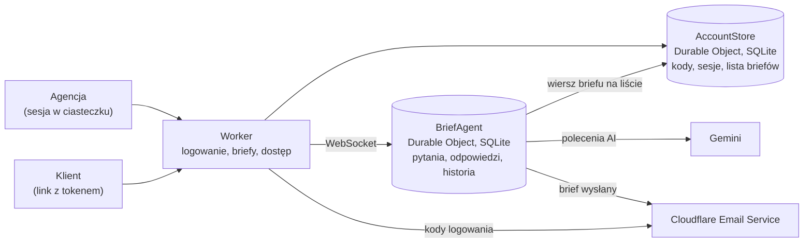

<div align="center">


# BriefFlow

**Klient klika. Ty masz brief.**

Brief z klientem bez formularzy do wypisywania. Wysyłasz jeden link, klient odpowiada na jedno pytanie naraz, głównie klikając, a każda odpowiedź od razu trafia do Twojego briefu.

</div>

<p align="center">
  
</p>

BriefFlow to narzędzie dla agencji, które zbierają od klientów briefy na strony i sklepy. Osoba z agencji loguje się adresem firmowym i kodem z maila, tworzy brief z szablonu i wysyła klientowi link. Klient nie zakłada konta: klika odpowiedzi, a gdy czegoś nie wie, wybiera „Nie wiem” albo „Pomiń na razie” i wraca później. Agencja i klient widzą zmiany na żywo, więc brief można wypełnić razem na spotkaniu albo po prostu wysłać.

## Jak to działa

1. **Tworzysz brief.** Wpisujesz klienta i wybierasz szablon „Strona WWW” (30 pytań, około 6 minut dla klienta) albo pusty brief. Pytania zmienisz ręcznie albo poleceniem dla AI.
2. **Wysyłasz link.** Klient dostaje jeden link. Bez konta i bez hasła, na telefonie albo laptopie.
3. **Czytasz brief na żywo.** Odpowiedzi wpadają przy każdym kliknięciu. Gdy klient wyśle brief, dostajesz maila.

### Klient odpowiada, klikając

<p align="center">
  
</p>

- Jedno pytanie naraz, w formie rozmowy. Odpowiedzi to kafelki do kliknięcia; pole tekstowe pojawia się tylko tam, gdzie nie da się klikać.
- „Nie wiem” i „Pomiń na razie” niczego nie blokują. Pominięte pytania czekają na uzupełnienie.
- Odpowiedzi zapisują się przy każdym kliknięciu. Klient wraca tym samym linkiem i zaczyna tam, gdzie przerwał.
- Obok rozmowy klient widzi swój brief, który rośnie z każdą odpowiedzią.

### Agencja ma brief, z którym da się zacząć projekt

<p align="center">
  
</p>

<sub>Przykładowe polecenie. Treść dodanych pytań zależy od modelu, zmiany zawsze widać w podsumowaniu i w historii.</sub>

- **Polecenia dla AI.** Piszesz, co dodać albo zmienić, a AI przerabia pytania narzędziami (dodaj pole, zmień, przenieś, dodaj sekcję). Domyślnie tworzy pytania do klikania. Każde polecenie to jeden krok, który cofasz jednym kliknięciem. AI nie odpowiada za klienta.
- **Przed startem.** Czego brakuje w Bazie (bez tego nie startujemy), na co reagować od razu i co idzie do osobnej wyceny. Proste reguły na odpowiedziach, bez AI.
- **Historia zmian.** Kto, co i kiedy zmienił. Zmiany pytań da się cofnąć, odpowiedzi zostają.
- **Pytania, które pojawiają się same.** Na przykład płatności i dostawę zobaczy tylko klient, który zaznaczy sklep internetowy.
- **11 typów pól:** jeden wybór, wiele wyborów, tak / nie, skala, materiał (logo, zdjęcia, teksty), krótki tekst, dłuższy tekst, potwierdzenie, obszar działania, termin, oświadczenie.

## Uruchomienie

Potrzebujesz Node.js i pnpm.

```bash
pnpm install
cp .dev.vars.example .dev.vars   # wpisz GEMINI_API_KEY (Google AI Studio), żeby działały polecenia AI
pnpm dev
```

Lokalnie nie trzeba się logować: aplikacja od razu wchodzi na konto deweloperskie (`dev@designhouse.me`, zmiana przez `DEV_EMAIL` w `.dev.vars`). Ta ścieżka nie trafia do buildu produkcyjnego. Bez klucza Gemini działa wszystko poza poleceniami AI.

Przydatne polecenia: `pnpm typecheck` (TypeScript), `pnpm types` (typy wiązań z `wrangler.jsonc`), `pnpm build`.

### Podgląd maili (Mailpit)

```bash
docker run -d --name dh-mailpit -p 127.0.0.1:8025:8025 -p 127.0.0.1:1025:1025 axllent/mailpit
```

Z `MAILPIT_URL=http://127.0.0.1:8025` w `.dev.vars` maile z dev trafiają do Mailpita: http://127.0.0.1:8025. Przykład każdego szablonu wyślesz poleceniem `curl -X POST http://localhost:5173/api/dev/emails` (trasa istnieje tylko w dev). Szablony są w `src/server/emails.ts`.

## Wdrożenie

BriefFlow działa na Cloudflare Workers.

```bash
pnpm exec wrangler email sending enable designhouse.me   # raz: domena nadawcy kodów
pnpm exec wrangler secret put GEMINI_API_KEY
pnpm run deploy
```

- Aplikacja działa pod https://briefflow.designhouse.me (domena własna Workera, `routes` w `wrangler.jsonc`). Rekord DNS i certyfikat Cloudflare tworzy przy pierwszym wdrożeniu; adres workers.dev i podglądy wersji są wyłączone, bo ciasteczko sesji, sprawdzanie `Origin` i linki w mailach zakładają jeden origin.
- Na produkcji briefy i konta są przechowywane w UE (jurysdykcja Durable Objects `eu`). Lokalnie ta opcja jest wyłączona, bo lokalny runtime jej nie obsługuje.

### Konfiguracja

| Zmienna | Gdzie | Do czego |
|---|---|---|
| `GEMINI_API_KEY` | sekret (`wrangler secret put`), lokalnie `.dev.vars` | polecenia AI; bez klucza okno poleceń jest wyłączone |
| `EMAIL_FROM` | `vars` w `wrangler.jsonc` | nadawca kodów i powiadomień (domyślnie `brief@designhouse.me`); jego domena musi być włączona w Cloudflare Email Service |
| `ALLOWED_EMAIL_DOMAINS` | `vars` w `wrangler.jsonc` | kto może się zalogować: domeny po przecinku (domyślnie `designhouse.me`), pusto = każdy adres |
| `DEV_EMAIL` | `.dev.vars` | konto deweloperskie w `pnpm dev` |
| `MAILPIT_URL` | `.dev.vars` | maile z dev idą do Mailpita zamiast do Cloudflare Email Service |

## Architektura



Szczegóły logowania i pełna lista tego, co zapisujemy na Cloudflare: [docs/dane-i-logowanie.md](docs/dane-i-logowanie.md). Regulamin i polityka prywatności (wersje robocze do weryfikacji prawnej) są pod `/regulamin` i `/prywatnosc`.

- **Logowanie:** `POST /api/auth/start` wysyła 6-cyfrowy kod (ważny 10 minut, 5 prób, nowy najwcześniej po 30 s, najwyżej 5 na godzinę), `POST /api/auth/verify` ustawia ciasteczko sesji (`HttpOnly`, `SameSite=Lax`, 30 dni).
- **Konto:** jedno konto = jedna instancja `AccountStore` (Durable Object z SQLite, nazwana skrótem adresu). Trzyma skróty kodów i sesji oraz listę briefów tej osoby.
- **Brief:** jeden brief = jedna instancja Agenta (Cloudflare Agents SDK, Durable Object z SQLite). Stan briefu synchronizuje się przez WebSocket do wszystkich otwartych widoków. Każda zmiana stanu odświeża też wiersz briefu na koncie właściciela (tytuł, postęp, wysyłka).
- **Role:** rola wynika z tokenu. Klient ma token w linku. Agencja łączy się bez tokenu: Worker sprawdza sesję i własny origin, a token agencji dokleja po stronie serwera, więc nie trafia on do przeglądarki. Przeglądarka nie może nadpisać stanu: wszystkie zmiany idą przez metody `@callable` ze sprawdzeniem roli.
- **Struktura briefu** (sekcje → pola) jest zmieniana tylko przez funkcje z `src/shared/ops.ts`. Z tych samych funkcji korzysta edycja ręczna i AI.
- **AI** (`src/server/ai.ts`) dostaje opis briefu i polecenie agencji, a zmiany robi narzędziami (`add_field`, `update_field`, `move_field`, `add_section`…). Pola tekstowe wymagają uzasadnienia: domyślnie AI tworzy pytania do klikania. Każde polecenie AI to jeden krok do cofnięcia.

### Stos

TypeScript, React 19 i Vite po stronie klienta; Cloudflare Workers, Durable Objects z SQLite i Agents SDK na serwerze; Gemini (`@google/genai`) do poleceń AI; Cloudflare Email Service do maili. Krój Atkinson Hyperlegible Next, ikony Tabler.

## Struktura

```
src/shared/types.ts        typy briefu, katalog typów pól
src/shared/ops.ts          operacje na strukturze, widoczność warunkowa, postęp
src/shared/flow.ts         kolejność pytań w rozmowie klienta
src/shared/checks.ts       kontrole przed startem: Baza, flagi, wycena
src/shared/templates.ts    szablony („Strona WWW”, pusty)
src/shared/account.ts      lista briefów na koncie agencji
src/server/index.ts        Worker: logowanie, lista i tworzenie briefów, dostęp, routing do Agenta
src/server/auth.ts         kody z maila, sesja w ciasteczku
src/server/accounts.ts     AccountStore: kody, sesje, briefy jednej osoby
src/server/brief-agent.ts  Agent briefu: role, odpowiedzi, edycja, cofanie, historia, AI
src/server/ai.ts           narzędzia i pętla poleceń AI
src/server/emails.ts       szablony maili i wysyłka (Cloudflare Email Service, Mailpit w dev)
src/client/Landing.tsx     strona startowa z logowaniem
src/client/AppShell.tsx    aplikacja agencji: pasek ikon, lista briefów, panel
src/client/Home.tsx        nowy brief
src/client/BriefPage.tsx   brief w aplikacji (agencja) i pod linkiem klienta
src/client/ClientFlow.tsx  rozmowa klienta i „Twój brief”
public/brand/              znak (orb) i grafika do podglądu linku
docs/                      opis danych i logowania, animacje do README
```

## Znane ograniczenia (MVP)

- Ręczne zmiany pytań zrobione w trakcie działania polecenia AI zostaną nadpisane wynikiem AI.
- Pliki (logo, zdjęcia) nie są jeszcze wgrywane: pole „Materiał” zbiera status i link.
- Brak przypomnień mailowych i wykrywania luk przez AI.
- Brief widzi tylko osoba, która go utworzyła. Wspólnych briefów zespołu jeszcze nie ma.
- Limit kodów jest liczony na adres, nie na IP.

## Licencja

Kod jest udostępniony na licencji [Apache 2.0](LICENSE). Kto rozpowszechnia kod albo pracę na nim opartą, musi zachować plik [NOTICE](NOTICE) z informacją o autorstwie (Design House).

Licencja nie obejmuje nazwy i logo Design House (`public/brand/dh/`, `public/favicon.*`, `public/apple-touch-icon.png`). To znaki Design House; w forku podmień je na własne.
