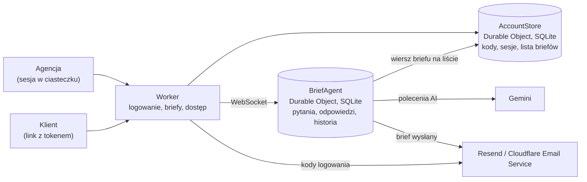

# BriefFlow dla deweloperów

Jak uruchomić, wdrożyć i rozwijać BriefFlow. Opis produktu jest w [README](../README.md), a szczegóły logowania i danych w [dane-i-logowanie.md](dane-i-logowanie.md).

## Uruchomienie

Potrzebujesz Node.js i pnpm.

```bash
pnpm install
cp .dev.vars.example .dev.vars   # wpisz GEMINI_API_KEY (Google AI Studio), żeby działały polecenia AI
pnpm dev
```

Lokalnie nie trzeba się logować: aplikacja od razu wchodzi na konto deweloperskie (`dev@designhouse.me`, zmiana przez `DEV_EMAIL` w `.dev.vars`). Ta ścieżka nie trafia do buildu produkcyjnego. Bez klucza Gemini działa wszystko poza poleceniami AI.

Przydatne polecenia: `pnpm typecheck` (TypeScript), `pnpm test` (walidacja logo/szablonów, eksport i współbieżność AI), `pnpm types` (typy wiązań z `wrangler.jsonc`), `pnpm build`. Z uruchomionym dev `node scripts/check-account-api.mjs` sprawdza izolację kont i zasoby przez HTTP, tworząc i usuwając wyłącznie własne dane testowe.

### Podgląd maili (Mailpit)

```bash
docker run -d --name dh-mailpit -p 127.0.0.1:8025:8025 -p 127.0.0.1:1025:1025 axllent/mailpit
```

Z `MAILPIT_URL=http://127.0.0.1:8025` w `.dev.vars` maile z dev trafiają do Mailpita: http://127.0.0.1:8025. Przykład każdego szablonu wyślesz poleceniem `curl -X POST http://localhost:5173/api/dev/emails` (trasa istnieje tylko w dev). Szablony są w `src/server/emails.ts`.

## Wdrożenie

BriefFlow działa na Cloudflare Workers.

```bash
pnpm exec wrangler secret put RESEND_API_KEY
pnpm exec wrangler secret put GEMINI_API_KEY
pnpm run deploy
```

- Aplikacja działa pod https://briefflow.designhouse.me (domena własna Workera, `routes` w `wrangler.jsonc`). Rekord DNS i certyfikat Cloudflare tworzy przy pierwszym wdrożeniu; adres workers.dev i podglądy wersji są wyłączone, bo ciasteczko sesji, sprawdzanie `Origin` i linki w mailach zakładają jeden origin.
- Na produkcji briefy i konta są przechowywane w UE (jurysdykcja Durable Objects `eu`). Lokalnie ta opcja jest wyłączona, bo lokalny runtime jej nie obsługuje.
- `RESEND_API_KEY` wybiera wysyłkę przez Resend. Domena adresu `EMAIL_FROM` musi być zweryfikowana na tym samym koncie Resend. Klucz z uprawnieniem „Sending access” wystarcza do wysyłki, ale nie pozwala odczytać listy domen. Bez tego sekretu aplikacja używa istniejącego bindingu Cloudflare Email Service; wtedy domenę włącza się przez `pnpm exec wrangler email sending enable designhouse.me`.

### Konfiguracja

| Zmienna | Gdzie | Do czego |
|---|---|---|
| `GEMINI_API_KEY` | sekret (`wrangler secret put`), lokalnie `.dev.vars` | polecenia AI; bez klucza okno poleceń jest wyłączone |
| `RESEND_API_KEY` | sekret (`wrangler secret put`), lokalnie `.dev.vars` | maile przez [Resend Email API](https://resend.com/docs/api-reference/emails/send-email); klucz pozostaje na serwerze |
| `EMAIL_FROM` | `vars` w `wrangler.jsonc` | nadawca kodów i powiadomień (domyślnie `briefflow@designhouse.me`); jego domena musi być zweryfikowana u wybranego dostawcy wysyłki |
| `ALLOWED_EMAIL_DOMAINS` | `vars` w `wrangler.jsonc` | kto może się zalogować: domeny po przecinku; domyślnie pusto, czyli każdy adres. Każdy adres ma osobne konto |
| `DEV_EMAIL` | `.dev.vars` | konto deweloperskie w `pnpm dev` |
| `MAILPIT_URL` | `.dev.vars` | maile z dev idą do Mailpita; ma pierwszeństwo przed Resend i Cloudflare. Błąd Mailpita nie przełącza na prawdziwą wysyłkę |

## Architektura



Regulamin i polityka prywatności są pod `/regulamin` i `/prywatnosc` (`src/client/Legal.tsx`). Opisują publiczny zakres MVP oraz limity konta. Pozostają robocze do potwierdzenia warunków powierzenia, konfiguracji dostawców i retencji; konkretne brakujące fakty opisuje [dane-i-logowanie.md](dane-i-logowanie.md). Nie traktujemy polityki jako dowodu zawarcia umów z dostawcami.

- **Logowanie:** `POST /api/auth/start` wysyła 6-cyfrowy kod (ważny 10 minut, 5 prób, nowy najwcześniej po 30 s, najwyżej 5 na godzinę), `POST /api/auth/verify` ustawia ciasteczko sesji (`HttpOnly`, `SameSite=Lax`, 30 dni).
- **Konto:** jedno konto = jedna instancja `AccountStore` (Durable Object z SQLite, nazwana skrótem adresu). Trzyma skróty kodów i sesji oraz listę briefów tej osoby.
- **Brief:** jeden brief = jedna instancja Agenta (Cloudflare Agents SDK, Durable Object z SQLite). Stan briefu synchronizuje się przez WebSocket do wszystkich otwartych widoków. Każda zmiana stanu odświeża też wiersz briefu na koncie właściciela (tytuł, postęp, wysyłka).
- **Role:** rola wynika z tokenu. Klient ma token w linku. Agencja łączy się bez tokenu: Worker sprawdza sesję i własny origin, a token agencji dokleja po stronie serwera, więc nie trafia on do przeglądarki. Przeglądarka nie może nadpisać stanu: wszystkie zmiany idą przez metody `@callable` ze sprawdzeniem roli.
- **Struktura briefu** (sekcje → pola) jest zmieniana tylko przez funkcje z `src/shared/ops.ts`. Z tych samych funkcji korzysta edycja ręczna i AI.
- **AI** (`src/server/ai.ts`) dostaje opis briefu i polecenie agencji, a zmiany robi narzędziami (`add_field`, `update_field`, `move_field`, `add_section`…). Pola tekstowe wymagają uzasadnienia: domyślnie AI tworzy pytania do klikania. Każde polecenie AI to jeden krok do cofnięcia.
- **Limity bezpłatnego konta:** 3 aktywne briefy (bez `completedAt`) i 10 poleceń AI w miesiącu kalendarzowym Europe/Warsaw. Wysłanie przez klienta lub zakończenie przez właściciela zwalnia miejsce bez usuwania danych. Poprawna odpowiedź AI, także bez zmian, zużywa limit; błąd, timeout i odrzucony nieaktualny wynik nie. Zakończone briefy pozostają do odczytu i edycji, bez osobnej funkcji ponownego otwierania.

### Stos

TypeScript, React 19 i Vite po stronie klienta; Cloudflare Workers, Durable Objects z SQLite i Agents SDK na serwerze; Gemini (`@google/genai`) do poleceń AI; Resend do maili (Cloudflare Email Service jako transport bez klucza Resend). Krój Atkinson Hyperlegible Next, ikony Tabler.

## Struktura

```
src/shared/types.ts        typy briefu, katalog typów pól
src/shared/ops.ts          operacje na strukturze, widoczność warunkowa, postęp
src/shared/flow.ts         kolejność pytań w rozmowie klienta
src/shared/checks.ts       kontrole przed startem: Baza, flagi, wycena
src/shared/templates.ts    szablony („Strona WWW”, pusty)
src/shared/account.ts      lista briefów na koncie agencji
src/server/index.ts        Worker: logowanie, lista i tworzenie briefów, dostęp, routing do Agenta
src/server/auth.ts         kody z maila, sesja w ciasteczku
src/server/accounts.ts     AccountStore: kody, sesje, briefy jednej osoby
src/server/account-quotas.ts  limity briefów i AI, rezerwacje, miesiąc Europe/Warsaw
src/server/brief-agent.ts  Agent briefu: role, odpowiedzi, edycja, cofanie, historia, AI
src/server/ai.ts           narzędzia i pętla poleceń AI
src/server/emails.ts       szablony maili i wysyłka (Resend / Cloudflare, Mailpit w dev)
src/client/Landing.tsx     strona startowa z logowaniem
src/client/AppShell.tsx    aplikacja agencji: pasek ikon, lista briefów, panel
src/client/Home.tsx        nowy brief
src/client/BriefPage.tsx   brief w aplikacji (agencja) i pod linkiem klienta
src/client/ClientFlow.tsx  rozmowa klienta i „Twój brief”
public/brand/              znak (orb) i grafika do podglądu linku
docs/media/                animacje do README
design/film/               źródło animacji (kompozycja HTML, render do MP4 i WebP)
```

## Animacje w README

Animacje w `docs/media/` powstają z `design/film/index.html`: każda klatka to funkcja czasu, a ekrany korzystają z CSS aplikacji i z kart wygenerowanych z jej komponentów (`gen-data.tsx` → `data.js`). Do renderu potrzebne są Node.js, ffmpeg, Python z Pillow i Chromium.

```bash
cd design/film
node render.mjs --src index.html --params "only=klient" --out klient.mp4   # także: kula, agencja
python3 webp.py out/klient.mp4 ../../docs/media/klient.webp 1000 20 85
```

`index.html` otwarty w przeglądarce odtwarza film na żywo (`?only=klient` pokazuje jedną pętlę, `?t=5` jedną klatkę). Po zmianie szablonu, kart albo ikon odśwież `data.js` poleceniem z nagłówka `gen-data.tsx`.

## Znane ograniczenia (MVP)

- Gdy podczas działania AI ktoś zmieni pytania ręcznie, stary wynik AI nie zapisuje się; polecenie trzeba powtórzyć. Odpowiedzi klienta zapisane w trakcie pracy AI pozostają.
- Materiały klienta pozostają linkami; wgrywać można wyłącznie logo nadawcy briefu.
- Brak przypomnień mailowych i wykrywania luk przez AI.
- Brief widzi tylko osoba, która go utworzyła. Wspólnych briefów zespołu jeszcze nie ma.
- Limit kodów jest liczony na adres, nie na IP.

### Logo, szablony i eksport

- `PUT /api/account/logo`: surowy PNG/JPEG/WebP, do 512 KiB i 2048 × 2048 px. Logo konta leży w SQLite `profile` istniejącego `AccountStore`; nie wymaga R2. GET logo wymaga sesji, a `/api/briefs/:id/logo?k=…` ważnego tokenu klienta danego briefu. DELETE usuwa logo. Odpowiedzi obrazowe mają `private, no-store` i `nosniff`.
- `/api/account/templates`: GET listuje własne szablony; POST `{briefId,title,description?}` zapisuje sekcje i pytania z własnego briefu. DELETE `/:id` usuwa szablon. Limit: 50 szablonów na konto, 30 sekcji, 300 pytań, 256 KiB struktury na szablon. Nowy brief dostaje świeże id pytań/opcji i przemapowane warunki, bez odpowiedzi i historii.
- Nowe zapisy i operacje na briefach wymagają własnego `Origin`; skrypty HTTP muszą go podać. Logo i szablony nie są dostępne między kontami.
- `src/client/brief-export.ts` otwiera podgląd A4 w dialogu i iframe bieżącej strony: czarny znak DH z napisem BriefFlow, logo nadawcy, sekcje, karty odpowiedzi, liczniki, statusy i klikalne linki. Używa fontów Atkinson z załadowanych zasobów aplikacji. PDF powstaje przez „Zapisz jako PDF” w oknie drukowania, bez serwera i dodatkowej usługi. Druga funkcja buduje tekst do schowka.
- Rozbudowany widok historii jest usunięty; istniejący zapis zmian nadal obsługuje cofanie pytań.

Testy eksportu sprawdzają bezpieczny HTML, widoczność pytań, format odpowiedzi, metadane, linki, logo i źródła fontów. Podgląd aplikacji jest weryfikowany w przeglądarce. Samo przejście tych testów nie potwierdza zapisania natywnego pliku PDF ani paginacji w każdym silniku drukowania; przy zmianach wydruku trzeba zapisać reprezentatywny wielostronicowy brief do PDF i sprawdzić jego strony.

## Licencja

Kod jest udostępniony na licencji [Apache 2.0](../LICENSE). Kto rozpowszechnia kod albo pracę na nim opartą, musi zachować plik [NOTICE](../NOTICE) z informacją o autorstwie (Design House).

Licencja nie obejmuje nazwy i logo Design House (`public/brand/dh/`, `public/favicon.*`, `public/apple-touch-icon.png`). To znaki Design House; w forku podmień je na własne.
